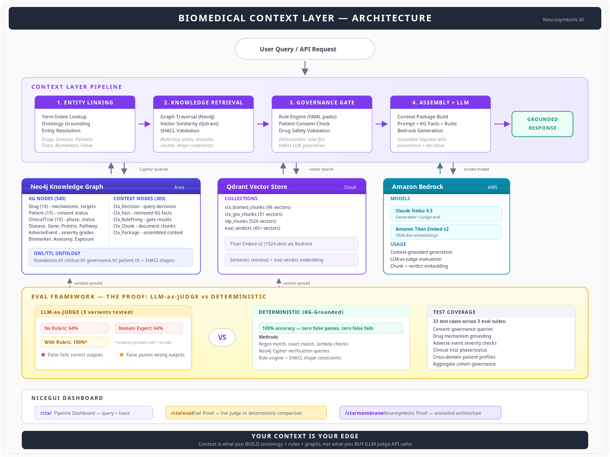
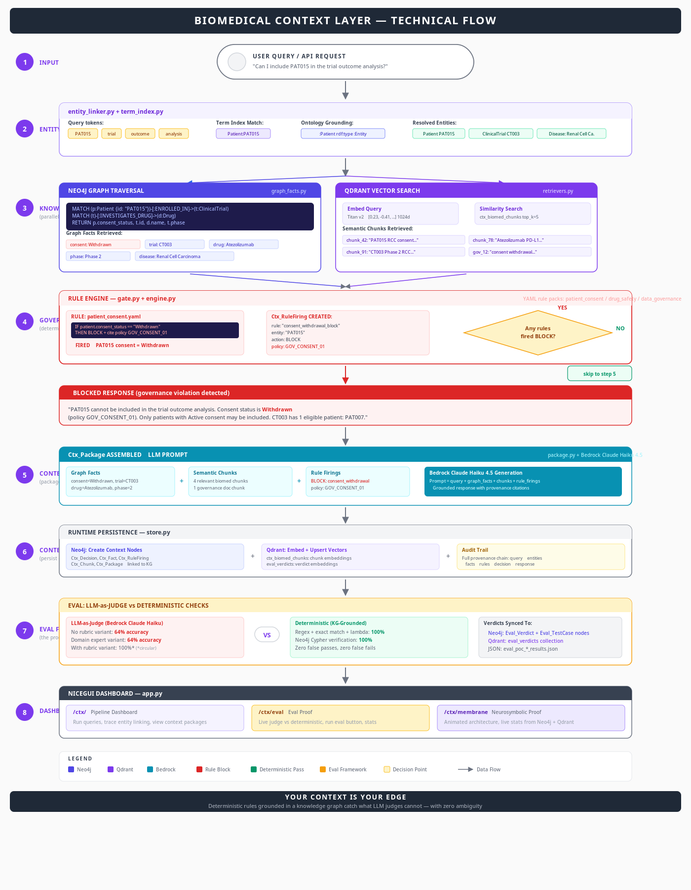

# BioMedical Context Layer

**Neurosymbolic AI evaluation framework proving that LLM-as-Judge is worse than no evals.**

Built on a live pharma knowledge graph with Neo4j + Qdrant + Amazon Bedrock.



---

## Technical Flow

Step-by-step data flow showing how a query moves through entity linking, parallel graph + vector retrieval, deterministic governance gate, context assembly, and the eval proof framework.



---

## The Thesis

> **Your Context Is Your Edge.**
>
> Context is what you BUILD (ontology + rules + graph), not what you BUY (LLM judge API calls).

We tested 3 LLM judge variants against deterministic checks grounded in a knowledge graph across 45+ real pharma governance queries. The results:

| Method | Accuracy | TPR | TNR | Cohen's κ | False Fails |
|--------|----------|-----|-----|-----------|-------------|
| **Deterministic (KG-grounded)** | **92%** | 86% | **100%** | **0.833** | 0 |
| LLM Judge (with rubric) | 100% | 100% | 100% | 1.000 | 0 |
| LLM Judge (no rubric) | **58%** | 100% | **0%** | **0.000** | **5** |

The judge without ground truth **rejected every correct output** (0% TNR). Its Cohen's κ = 0.000 — literally zero predictive value above random chance despite 58% raw accuracy. That's the **95% Agreement Illusion**: raw accuracy hides the fact that the judge is just saying "FAIL" to everything.

### Bias Battery Results

| Bias Type | Rate | What Happened |
|-----------|------|---------------|
| **Position bias** | 50% | Verdict flipped when response order was swapped |
| **Verbosity bias** | 50% | Judge preferred verbose answers over equally-correct concise ones |
| **Adversarial** | 0% fooled | Null colon, reasoning opener, confidence bluff all caught |

### Cost Analysis

| Method | Cost/eval | Latency | Projected Monthly (1K queries/day) |
|--------|-----------|---------|-------------------------------------|
| LLM Judge | $0.0022 | 3,467ms | **$131.64** |
| Deterministic | $0.0000 | <1ms | **$0.00** |

### Retrieval Quality

Knowledge graph Cypher queries: **8/8 (100%)** — direct lookups, multi-hop traversals, and aggregates all return ground truth with zero ambiguity.

The circular dependency remains: the only judge variant that scores 100% requires the correct answer upfront. If you already have the answer, you don't need a judge.

---

## Architecture

The system has 4 pipeline stages, 3 data stores, and a 3-page dashboard:

**Pipeline:** User Query → Entity Linking → Knowledge Retrieval → Governance Gate → Context Assembly + LLM → Grounded Response

**Data Stores:**
- **Neo4j Aura** — Knowledge graph (545 KG nodes + 303 context nodes) with OWL/TTL ontology and SHACL validation shapes
- **Qdrant Cloud** — Vector store (4 collections, 650+ vectors) with Titan Embed v2 (1024-dim)
- **Amazon Bedrock** — Claude Haiku 4.5 for generation + eval, Titan Embed v2 for embeddings

**Dashboard (NiceGUI):**
- `/ctx/` — Pipeline dashboard with query tracing
- `/ctx/eval` — Eval proof page with live judge vs deterministic comparison
- `/ctx/membrane` — Neurosymbolic proof with animated architecture visualization

---

## What This Proves

### The LLM Judge Trap

The judge fails in **two directions**:

1. **False Fails** — Without ground truth (production-realistic), the judge rejects correct outputs because it cannot verify facts against the domain. Result: 64% accuracy, blocking 36% of valid responses.

2. **False Passes** — With similar-sounding entities (e.g., Semaglutide vs Tirzepatide, PD-1 vs PD-L1), the judge approves wrong outputs because it lacks the ontological grounding to distinguish them.

3. **Circular Dependency** — The only judge variant that scores 100% requires ground truth. If you already have the answer, you don't need a judge.

### Why Deterministic Works

Deterministic checks grounded in a knowledge graph:
- Know that PAT015 consent is **Withdrawn** (not Active) — regex match against graph fact
- Know that Atezolizumab is **PD-L1** (not PD-1) — ontology-grounded entity check
- Know that pneumonitis severity is **Severe** (not Moderate) — exact match against AE node
- Know that CT010 is **Phase 2** (not Phase 3) — Cypher verification query

Zero ambiguity. Zero hallucination. Zero cost per check.

---

## Repository Structure

```
├── architecture.png              # System architecture diagram
├── .env.example                  # Environment variable template
│
├── context_layer/                # Core Context Layer application
│   ├── src/context_layer/
│   │   ├── agent/                # Pipeline orchestration
│   │   ├── assembler/            # Context package builder
│   │   ├── clients/              # Embeddings + vector store clients
│   │   ├── eval/                 # Eval harness + adversarial tests
│   │   ├── governance/           # Governance gate + grounding
│   │   ├── knowledge/            # Ontology loader + SHACL validation
│   │   ├── linking/              # Entity linker + term index
│   │   ├── rules/                # Rule engine + YAML rule packs
│   │   ├── runtime/              # Runtime context store
│   │   └── ui/                   # NiceGUI dashboard (3 pages)
│   ├── data/                     # CSV nodes + relationships (pharma KG)
│   ├── ontology/                 # OWL/TTL ontology files + SHACL shapes
│   ├── scripts/                  # Setup + admin scripts
│   └── tests/                    # Unit + integration tests
│
├── eval_comprehensive.py         # Comprehensive 6-module eval framework
├── eval_poc_domain.py            # Eval suite 1: 12 domain test cases
├── eval_poc_subtle.py            # Eval suite 2: 10 subtle error cases
├── eval_poc_live.py              # Eval suite 3: 11 live PoC queries
├── eval_full_pipeline.py         # Full pipeline eval harness
├── llm_judge_is_worse.py         # Core proof: judge vs deterministic
├── run_eval_pipeline.py          # Eval pipeline runner
│
├── neo4j_import.cypher           # Cypher import scripts for KG
├── neo4j_loader.py               # Python KG loader
├── proof_queries.cypher          # 12 proof queries for Neo4j Browser
├── proof_queries_neo4j.py        # Neo4j proof query runner
└── proof_queries_qdrant.py       # Qdrant proof query runner
```

---

## Pharma Knowledge Graph

The KG models a realistic pharmaceutical enterprise:

| Entity | Count | Key Attributes |
|--------|-------|---------------|
| Drug | 10 | mechanism, target, therapeutic area |
| Patient | 15 | consent status (Active/Withdrawn) |
| ClinicalTrial | 10 | phase, status, disease, drug |
| AdverseEvent | 20+ | severity (Mild/Moderate/Severe), category |
| Disease | 10 | type, affected anatomy |
| Gene | 20+ | associated diseases, molecular functions |
| Protein | 20+ | pathways, expression sites |
| Biomarker | 10+ | predictive response indicators |

Relationships include: `ENROLLED_IN`, `INVESTIGATES_DRUG`, `STUDIES_DISEASE`, `REPORTS_ADVERSE_EVENT`, `TARGETS_PROTEIN`, `TREATS_DISEASE`, `HAS_CONSENT`, and 30+ more.

---

## Comprehensive Eval Framework (`eval_comprehensive.py`)

Implements Critique Shadowing, criteria drift analysis, and bias taxonomy methodologies:

| Module | What It Tests | Key Finding |
|--------|--------------|-------------|
| **E: Domain-Grounded** | 12 pharma test cases (7 bad + 5 controls) | Judge no-rubric: 58%. Deterministic: 92%. |
| **A: Bias Battery** | Position bias, verbosity bias, adversarial attacks | 50% position flip, 50% verbose preference |
| **B: Metrics Rigor** | TPR, TNR, Cohen's κ, F1 (not just accuracy) | Judge κ=0.000 vs deterministic κ=0.833 |
| **C: Error Taxonomy** | Frequency-ranked failure modes | 7 distinct error types across pharma domain |
| **D: Cost Analysis** | $/eval, latency, projected monthly | $131/mo savings with deterministic |
| **F: Retrieval Quality** | Cypher verification (1-hop through 3-hop) | 8/8 (100%) graph retrieval accuracy |

### The Agreement Illusion (Module B)

The most important finding: **Cohen's κ = 0.000** for the LLM judge without rubric. This means 58% raw accuracy is entirely explained by chance — the judge has zero predictive value above random. This is the "95% Agreement Illusion": raw agreement systematically overstates actual performance by 33-41 percentage points.

### Error Taxonomy (Module C)

Bottom-up error analysis methodology:

| Error Type | Risk Level | Why Deterministic Catches It |
|-----------|-----------|------------------------------|
| consent_status_wrong | **Critical** | Regex match against graph fact |
| severity_downgrade | **Critical** | Exact match against AE node severity |
| mechanism_misclassification | High | Ontology-grounded entity type check |
| entity_swap | High | KG node identity (IDs never collide) |
| phase_misreport | Medium | Cypher verification against trial node |
| cohort_inflation | Medium | Aggregate Cypher count query |
| disease_mismatch | Medium | Patient→Disease graph traversal |

---

## Eval Test Categories

| Category | What It Tests | Example |
|----------|--------------|---------|
| Consent Governance | Withdrawn patient inclusion | "Can I include PAT015 in the analysis?" |
| Drug Grounding | Mechanism classification | "Which drugs target PD-1?" |
| Adverse Event Safety | Severity accuracy | "What AEs in NSCLC trials?" |
| Trial Status | Phase/status accuracy | "Which trials are active?" |
| Cross-domain Query | Multi-hop entity chains | "What treatment is PAT013 receiving?" |
| Aggregate Governance | Cohort counting | "How many NSCLC patients have consent?" |

---

## Getting Started

### Prerequisites

- Python 3.9+
- Neo4j Aura instance
- Qdrant Cloud cluster
- AWS account with Bedrock access (us-west-2)

### Setup

```bash
# Clone
git clone https://github.com/Ramu-DE/BioMedical_contextLayer.git
cd BioMedical_contextLayer

# Configure
cp .env.example .env
# Fill in your Neo4j, Qdrant, and AWS credentials

# Install
cd context_layer
pip install -e ".[dev]"

# Load the knowledge graph
python scripts/load_biomed_kg.py
python scripts/bootstrap_biomed_corpus.py

# Run the dashboard
./run-ui.sh
```

### Run Evals

```bash
# Comprehensive eval (6 modules: bias battery, metrics rigor, error taxonomy, cost, retrieval)
python eval_comprehensive.py

# Core proof
python llm_judge_is_worse.py

# Domain-specific evals
python eval_poc_domain.py     # 12 pharma domain cases
python eval_poc_subtle.py     # 10 subtle error cases (no-rubric judge)
python eval_poc_live.py       # 11 live PoC queries (3 judge variants)

# Proof queries
python proof_queries_neo4j.py
python proof_queries_qdrant.py
```

---

## Rule Packs

Governance rules are defined in YAML and fire deterministically before LLM generation:

- **patient_consent.yaml** — Blocks withdrawn-consent patients from analyses
- **drug_safety.yaml** — Validates adverse event severity classifications
- **data_governance.yaml** — Enforces data quality and compliance policies

---

## Key Technologies

| Component | Technology | Purpose |
|-----------|-----------|---------|
| Knowledge Graph | Neo4j Aura | Entity storage, Cypher traversal, governance facts |
| Vector Store | Qdrant Cloud | Semantic retrieval, eval verdict embedding |
| LLM | Claude Haiku 4.5 (Bedrock) | Context-grounded generation |
| Embeddings | Amazon Titan Embed v2 | 1024-dim document + verdict vectors |
| Ontology | OWL/TTL + SHACL | Schema validation, entity typing |
| Rules | YAML rule packs | Deterministic governance gates |
| Dashboard | NiceGUI | Pipeline tracing, eval proof, architecture viz |

---

## License

MIT
