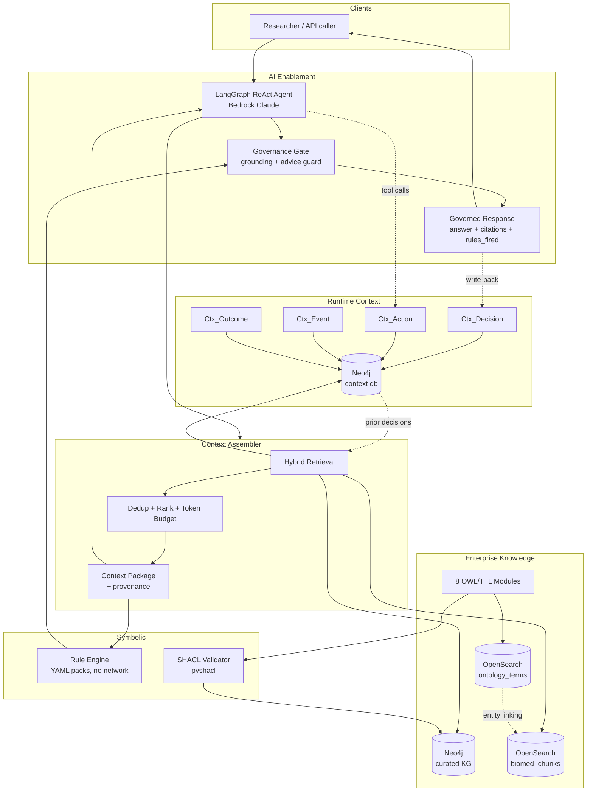
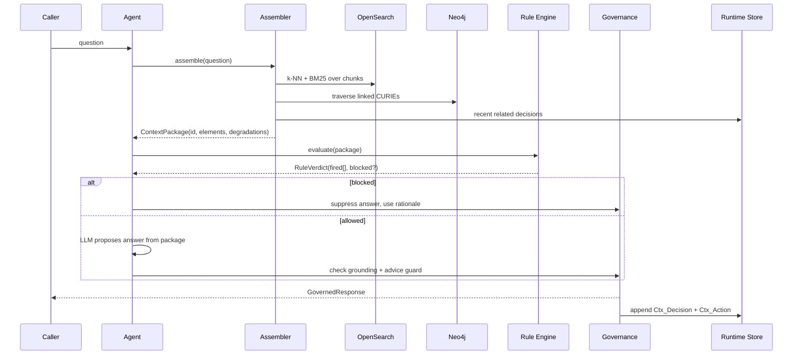

# Design: Biomedical Context Layer

## Overview

A context layer over an enterprise pharma **data governance** graph, hosted on
**Neo4j Aura 5.27 Enterprise** (graph, vector index, full-text index, and runtime
context) with **Amazon Bedrock** supplying embeddings and agent reasoning.

> **Revision (verified against live infrastructure, 2026-08-27).** The original
> design assumed a biomedical knowledge graph and an OpenSearch vector store.
> Neither matched reality:
>
> - The Aura instance holds a **pharma data governance graph** — 124 nodes,
>   19 populated labels: `Policy`, `RuleType`, `ARD`, `Table`, `DataDomain`,
>   `DataLayer`, `BusinessUnit`, `BusinessFunction`, `Entity`, `Job`, `Batch`,
>   plus clinical vocabularies `SNOMED`, `RxNorm`, `MedDRA`, `OMOP` and
>   `TherapeuticArea`. There are no Drug/Disease/Patient nodes.
> - **No OpenSearch exists** in the account (`list-domain-names` and
>   `list-collections` both empty in us-west-2 and us-east-1).
> - Neo4j 5.27-aura enterprise **does** provide `db.index.vector.createNodeIndex`,
>   `db.index.vector.queryNodes`, `db.index.fulltext.queryNodes`, and GDS.
>
> The layer therefore targets data governance, and Neo4j serves as both graph and
> vector store. This is a net improvement: the six real `Policy` nodes are
> directly executable as rules, and co-resident chunks make the chunk→concept link
> a real relationship rather than a cross-system join.

The architecture separates three concerns that the reference diagram treats as three
columns, and adds the component that binds them:

- **Enterprise Knowledge** — ontology-grounded, SHACL-validated. Read-mostly.
- **Runtime Context** — append-only events, decisions, actions, outcomes. Write-heavy.
- **AI Enablement** — a neurosymbolic agent whose every response is governed.
- **Context Assembler** — the binding component. Decides what enters the model window.

The critical design property is that **the symbolic path never passes through the
LLM**. Rules are evaluated deterministically over the assembled context package, and
a `block` verdict overrides generated text. This is what makes the system
neurosymbolic rather than a prompt that mentions rules.

### Verified infrastructure

| Dependency | Status | Evidence |
|---|---|---|
| Neo4j Aura | ✅ live | 5.27-aura enterprise, single user database named after the instance id, 124 nodes / 138 rels |
| Neo4j write access | ✅ live | created and removed a `:Ctx_WriteProbe` node |
| Neo4j vector index | ✅ available | `db.index.vector.createNodeIndex`, `queryNodes` |
| Neo4j full-text index | ✅ available | `db.index.fulltext.queryNodes` — enables hybrid retrieval |
| Bedrock embeddings | ✅ live | `amazon.titan-embed-text-v2:0`, dim 1024, us-west-2 |
| Bedrock LLM | ✅ live | `us.anthropic.claude-sonnet-4-6` returned `CONTEXT_LAYER_OK` |
| Qdrant Cloud | ✅ live | eu-central-1, 94 ms median RTT; `ctx_gov_chunks` holds 31 points at dim 1024 |
| OpenSearch | ❌ absent | no domains or collections provisioned |
| Multi-database | ❌ unavailable | single user database → `Ctx_` label-prefix isolation |

### Text corpus available for chunking

31 items, all already in the graph: 6 `Policy` descriptions, 7 `ARD` descriptions,
10 `RuleType` descriptions, 8 `RxNorm` indications.

### Empty labels

`BusinessProcess`, `Column`, `Connection`, `DQJob`, `DQRule`, `Domain`,
`SourceSystem`, `Tenant` have zero nodes. This matters for rule authoring:
`POL_HUB_DQ` ("hub tables must have at least one critical DQ rule") will find a
**real violation** on every hub table, because no `DQRule` instances exist. That is
a genuine finding for the demo, not a defect to paper over.

### Key design decisions

| Decision | Choice | Rationale |
|---|---|---|
| Domain | Pharma data governance | What the live graph actually contains; 6 executable policies |
| Graph store | Neo4j Aura 5.27 Enterprise | Verified live; holds the governance graph |
| Vector store | **Qdrant Cloud** (chunks) | 94 ms median vs Neo4j's 222 ms from this host; purpose-built filtering. Verified live |
| Term index | **Neo4j native HNSW** | Entity linking must verify concept existence in the graph anyway; keeps chunk→concept a real relationship |
| Qdrant collection | `ctx_gov_chunks`, **not** `idp_chunks` | The pre-existing collection stores stringified vectors in `chunk_text` across all 524 points; `config.check()` refuses it |
| Payload guard | `VectorRecord` rejects vector-shaped text | Prevents the `idp_chunks` defect from recurring; unit-tested |
| OpenSearch | Kept as a swappable backend | No domain provisioned; `VECTOR_BACKEND=opensearch` remains selectable |
| Runtime isolation | `Ctx_` label prefix | Aura instance exposes a single user database |
| Embeddings | Bedrock Titan Text v2 (1024-dim) | Verified live in us-west-2 |
| LLM | Bedrock `us.anthropic.claude-sonnet-4-6` | Verified live; matches module 5 |
| Entity linking | Embedding k-NN over vocabulary labels + graph verification | Targets `SNOMED`/`RxNorm`/`MedDRA`/`OMOP`; `OMOP_MAPS_TO` gives a ready crosswalk |
| Rule engine | Declarative YAML packs, pure-Python evaluator | No network, no LLM, deterministic and auditable |
| Rule content | The 6 live `Policy` nodes | Real policies detecting real violations, not synthetic examples |
| Temporal model | Bi-temporal (`valid_from`/`valid_to` + `occurred_at`/`ingested_at`) | Required for "as of" queries and out-of-order events |
| Decision store | Append-only `Ctx_*` Neo4j nodes | Durable across restarts, unlike the in-memory `audit_logger` replaced |
| Agent framework | LangGraph `create_react_agent` on Bedrock | Matches `module-5-langgraph-agent` |
| Config precedence | Non-empty `.env` wins over ambient env | Ambient `AWS_REGION=us-east-1` from an unrelated account would otherwise win silently |
| Secrets | `config.py` `Secret` type, `.env` at 0600, gitignored | Redacts in `repr()` and reports; test-verified |
| Language | Python 3.11+ (`.venv` via `uv`) | System Python is 3.9; matches the rest of the workshop |

---

## Architecture



The dashed write-back edge from `RESP` to `DEC`, feeding back into `RET`, is
"Continuous Incorporation". It is a graph write, not model training.

### Request flow



---

## Components and contracts

Each component is a module under `src/context_layer/`. Contracts are stated as
signatures; the implementation plan is in `tasks.md`.

### `clients/` — infrastructure adapters

| Module | Contract |
|---|---|
| `neo4j_client.py` | `query(cypher, params, database) -> list[dict]`. Parameterized only; rejects string interpolation |
| `opensearch_client.py` | `knn_search(index, vector, k, filters)`, `hybrid_search(index, text, vector, k)`, `bulk_index(index, docs)` |
| `embeddings.py` | `embed(texts: list[str]) -> list[list[float]]`, batched, retried with backoff |
| `llm.py` | `ChatBedrockConverse` wrapper matching module 5 |

### `knowledge/` — Enterprise Knowledge (R1, R2)

| Module | Contract |
|---|---|
| `ontology_loader.py` | `load_modules(paths) -> OntologyBundle` with per-module triple counts; aborts on parse error |
| `shacl_gate.py` | `validate(node_rdf, shape) -> ValidationReport(conforms, violations)` |
| `provenance.py` | `attach(assertion, source, ingested_at, confidence)`; `chain_for(answer_id) -> ProvenanceChain` |
| `catalog.py` | DCAT record emission on ingest |

### `linking/` — Linked Context (R4)

| Module | Contract |
|---|---|
| `term_index.py` | `build(bundle) -> int`. Embeds every ontology label and synonym into `biomed_ontology_terms`, keyed by CURIE |
| `entity_linker.py` | `link(chunk: TextChunk) -> list[EntityMention]`. Emits `unlinked` below threshold; verifies CURIE exists in Neo4j |

```python
@dataclass(frozen=True)
class EntityMention:
    chunk_id: str
    surface_form: str
    curie: str | None      # None => unlinked
    confidence: float
    start: int
    end: int
```

### `rules/` — Processes & Rules (R3)

| Module | Contract |
|---|---|
| `engine.py` | `evaluate(package) -> RuleVerdict`. Pure function. No network, no LLM |
| `loader.py` | `load_pack(path) -> RulePack`; validates required fields |
| `packs/*.yaml` | Declarative rules |

```yaml
# packs/contraindications.yaml
- id: contraindication.renal_impairment
  description: Nephrotoxic agent flagged for reduced renal function
  severity: block
  when:
    all:
      - entity_type: Drug
        has_property: {nephrotoxic: true}
      - entity_type: Patient
        has_property: {renal_function: reduced}
  rationale: >
    Nephrotoxic agents are contraindicated where renal function is reduced.
  cites: [bio:DataGovernancePolicy/renal-safety]
```

```python
@dataclass(frozen=True)
class FiredRule:
    rule_id: str
    severity: Literal["block", "warn", "inform"]
    rationale: str
    triggered_by: list[str]        # CURIEs

@dataclass(frozen=True)
class RuleVerdict:
    fired: list[FiredRule]
    blocked: bool                  # any severity == "block"
```

### `runtime/` — Runtime Context (R5, R6, R7)

| Module | Contract |
|---|---|
| `models.py` | `Event`, `Decision`, `Action`, `Outcome` — frozen, validated |
| `store.py` | `append_event`, `append_decision`, `append_action`, `append_outcome`, `recent_decisions(question_embedding, k)`, `as_of(timestamp)`. Append-only: no update or delete methods exist |

Neo4j graph model in the context database:

```
(:Ctx_Event   {event_id, event_type, occurred_at, ingested_at, payload})
(:Ctx_Decision{decision_id, question, context_package_id, rules_fired,
               answer_hash, grounding_confidence, decided_at,
               valid_from, valid_to})
(:Ctx_Action  {action_id, tool_name, arguments, duration_ms, status, at})
(:Ctx_Outcome {outcome_id, outcome_type, observed_at, detail})

(:Ctx_Decision)-[:PRODUCED]->(:Ctx_Action)
(:Ctx_Decision)-[:RESULTED_IN]->(:Ctx_Outcome)
(:Ctx_Decision)-[:USED_CONTEXT]->(:Ctx_Event)
(:Ctx_Event)-[:ABOUT]->(:Entity {curie})
(:Ctx_Decision)-[:GROUNDED_IN]->(:Entity {curie})
```

Append-only is enforced structurally: `store.py` exposes no mutating verbs, and
`valid_to` is set by writing a new version, never by updating in place.

### `assembler/` — Context Assembly (R8)

| Module | Contract |
|---|---|
| `retrievers.py` | `VectorRetriever`, `GraphRetriever`, `RuntimeRetriever` — each `retrieve(question) -> list[ContextElement]` |
| `package.py` | `assemble(question) -> ContextPackage` |

```python
@dataclass(frozen=True)
class ContextElement:
    element_id: str
    kind: Literal["chunk", "graph_node", "prior_decision"]
    content: str
    curies: list[str]
    provenance: Provenance
    score: float

@dataclass(frozen=True)
class ContextPackage:
    context_package_id: str
    question: str
    elements: list[ContextElement]
    token_count: int
    truncated: list[str]           # element_ids dropped by budget
    degradations: list[str]        # e.g. "graph_retriever_unavailable"
```

### `governance/` — Governed Responses (R10)

| Module | Contract |
|---|---|
| `grounding.py` | `score(answer, package) -> float`; citation coverage per claim |
| `guards.py` | `check_clinical_advice(question) -> GuardResult`; refusal messages |
| `contract.py` | `GovernedResponse` — the single published output schema |

```python
@dataclass(frozen=True)
class GovernedResponse:
    answer: str | None             # None when refused or blocked
    refused: bool
    refusal_reason: str | None
    citations: list[Citation]
    rules_fired: list[FiredRule]
    neural_proposal: str | None    # visible so neural vs symbolic is auditable
    symbolic_verdict: str
    context_package_id: str
    grounding_confidence: float
    degradations: list[str]
```

### `agent/` — Neurosymbolic Agent (R9)

| Module | Contract |
|---|---|
| `tools.py` | LangChain tools: `graph_lookup`, `vector_search`, `check_rules`, `prior_decisions` |
| `agent.py` | ReAct agent; HTTP `POST /invoke`, `GET /health`, MicroVM ready hook on 9000 |

Ordering is fixed by the governance gate, not by the prompt: rules are evaluated on
the assembled package **before** the answer is released, and a `block` verdict
suppresses it regardless of what the model produced.

---

## Error handling

| Failure | Behaviour |
|---|---|
| Neo4j unavailable | Assembler records `degradations: ["graph_retriever_unavailable"]`, continues on vector only, lowers grounding confidence |
| OpenSearch unavailable | Same pattern; graph-only retrieval |
| Both unavailable | Refuse. No ungrounded answers |
| Rule pack malformed | Fail at startup, not at request time |
| Embedding call fails | Retry with exponential backoff, then degrade |
| SHACL violation on write | Reject the write, report the violated constraint |
| LLM returns unparseable output | Refuse rather than pass through |
| Missing credential | `config.check()` fails fast at startup with the variable name |

Degradation is always **recorded and surfaced**, never silent (R8.5).

## Security

- Cypher and OpenSearch queries are parameterized; injection attempts rejected (R10.6)
- Secrets carried in the `Secret` type; redacted in `repr()` and in reports (R10.5)
- `.env` at mode 0600, gitignored, with a startup permission warning
- Runtime writes confined to the context database or `Ctx_` prefix (R5.3)
- No PHI. Synthetic and public data only
- Clinical advice guard blocks individual treatment guidance (R10.3)

## Testing strategy

| Layer | Focus |
|---|---|
| `tests/unit` | Rule evaluation determinism, contract shapes, config redaction, token budgeting |
| `tests/property` | Hypothesis: linker never emits a CURIE absent from the graph; append-only store never loses a decision; injection strings never reach a query |
| `tests/integration` | Live Neo4j + OpenSearch round trips; skipped when credentials absent |
| Evaluation harness | R11: context layer vs naive RAG on an identical question set, including adversarial scenarios |

Unit and property tests must pass with **no credentials configured**.
